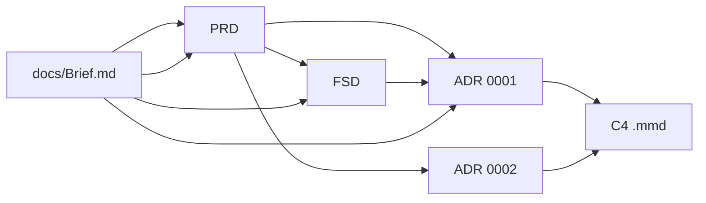

# Examen FTGO — Arquitectura con prompts mejorados

Laboratorio del caso **FTGO** (*Food To Go*), basado en *Microservices Patterns* (Chris Richardson, 2019). Documentas la arquitectura objetivo para migrar un monolito Java hacia microservicios (**Strangler Fig**), usando IA con prompts estructurados.

**Fuente canónica del dominio:** [`docs/Brief.md`](docs/Brief.md) (Anexo A). No inventar stakeholders, capacidades ni NFRs fuera del brief.

---

## Estructura del repositorio

| Ruta | Contenido |
| :--- | :--- |
| [`docs/Brief.md`](docs/Brief.md) | Brief oficial: stakeholders, 7 capacidades, NFRs, US-01…03 |
| [`docs/PROMPTS/`](docs/PROMPTS/) | Prompts **semilla** (v0.1) con TODOs vacíos — punto de partida del laboratorio |
| [`prompts_mejorados/`](prompts_mejorados/) | Prompts **mejorados** (v0.3): TODOs rellenados desde el brief + sección D4 + Changelog |
| `docs/PRD.md`, `docs/FSD.md`, … | Artefactos **generados** por ti (crear al ejecutar los prompts) |
| `docs/adr/` | ADRs numerados (`0001-*.md`, `0002-*.md`) |
| `c4_context.mmd`, `c4_container.mmd` | Diagramas C4 nivel 1 y 2 (raíz o `docs/diagrams/`) |

---

## Flujo recomendado

Ejecuta los prompts en este orden; cada paso consume la salida del anterior:



| Paso | Prompt | Artefacto de salida |
| :---: | :--- | :--- |
| 0 | — | Leer `docs/Brief.md` |
| 1 | [`prompts_mejorados/PRD.md`](prompts_mejorados/PRD.md) | `docs/PRD.md` |
| 2 | [`prompts_mejorados/FSD.md`](prompts_mejorados/FSD.md) | `docs/FSD.md` |
| 3 | [`prompts_mejorados/ADR.md`](prompts_mejorados/ADR.md) × 2 | `docs/adr/0001-*.md`, `0002-*.md` |
| 4 | [`prompts_mejorados/C4.md`](prompts_mejorados/C4.md) | `c4_context.mmd`, `c4_container.mmd` |

---

## Prompts mejorados (v0.4)

Cada archivo incluye: contexto del brief, criterios de stop, esqueleto de salida, **Changelog** (qué/por qué), sección D4 y **Métrica de calidad (antes / después)** con 6 corridas de registro.

| Prompt | ID | Modelo | Temp. | Sección D4 | Salida esperada |
| :--- | :--- | :--- | :---: | :--- | :--- |
| [PRD.md](prompts_mejorados/PRD.md) | PR-PRD-FTGO-001 | Sonnet / Opus | 0.2 | Verification | PRD ligero (≤ ~1 800 palabras) |
| [FSD.md](prompts_mejorados/FSD.md) | PR-FSD-FTGO-001 | Sonnet | 0.2 | Examples | FSD con ≥ 5 UCs + GWT |
| [ADR.md](prompts_mejorados/ADR.md) | PR-ADR-FTGO-001 | Opus | 0.3 | Anti-patterns | 1 ADR con ≥ 3 opciones |
| [C4.md](prompts_mejorados/C4.md) | PR-C4-FTGO-001 | Sonnet / Opus | 0.2 | Verification | 2 archivos Mermaid C4 |

---

## Uso en Cursor (o chat con archivos adjuntos)

### 1. Generar el PRD

**Adjuntar:** `docs/Brief.md` + `prompts_mejorados/PRD.md`

**Mensaje de ejemplo:**

```text
Aplica el prompt adjunto (PR-PRD-FTGO-001). Genera solo el PRD en Markdown
según el esqueleto del Output y las tablas del Context. Sin razonamiento previo.
Guarda mentalmente la estructura para docs/PRD.md.
```

**Verificar** con la checklist V1–V8 del prompt (sección Verification).

---

### 2. Generar el FSD

**Adjuntar:** `docs/Brief.md` + `docs/PRD.md` (generado) + `prompts_mejorados/FSD.md`

**Mensaje de ejemplo:**

```text
Aplica el prompt FSD (PR-FSD-FTGO-001). Usa el catálogo UC-01…UC-05 del Context.
Documenta los 5 UCs con los 7 campos y Given/When/Then. Solo el FSD en Markdown.
Máximo 2 500 palabras.
```

**Referencia de calidad:** sección *Examples (input/output)* del prompt (UC-01).

---

### 3. Generar un ADR

**Adjuntar:** `docs/Brief.md` + `docs/PRD.md` + `docs/FSD.md` + `prompts_mejorados/ADR.md`

**Mensaje de ejemplo (descomposición):**

```text
Aplica el prompt ADR (PR-ADR-FTGO-001).

Parámetro de decisión: estrategia de descomposición (microservicios vs monolito modular vs journeys).

Respeta restricciones R-01…R-10. Evalúa ≥ 3 opciones con pros, contras e impacto en NFRs.
Incluye consecuencias positivas y negativas. Evita los anti-patterns listados en el prompt.
Status: Proposed.
```

**Segundo ADR (ejemplo IPC):**

```text
Mismo prompt ADR. Parámetro: mecanismo IPC predominante (REST síncrono vs eventos Kafka vs híbrido).
No repitas el ADR 0001; profundiza en R-02 (latencia) y R-04 (pasarela caída).
```

Guardar como `docs/adr/0001-estrategia-descomposicion.md` y `docs/adr/0002-ipc-predominante.md`.

---

### 4. Generar diagramas C4

**Adjuntar:** `docs/Brief.md` + `docs/PRD.md` + `docs/adr/0001-*.md` + `docs/adr/0002-*.md` + `prompts_mejorados/C4.md`

**Mensaje de ejemplo:**

```text
Aplica el prompt C4 (PR-C4-FTGO-001).

Entrega dos bloques separados:
1) contenido completo de c4_context.mmd (solo C4Context, sin fences markdown)
2) contenido completo de c4_container.mmd (solo C4Container)

Incluye los 4 Person y 4 System_Ext del brief §A.2. Coherente con los ADRs (Kafka si async).
Valida C1–C7 y K1–K8 antes de responder.
```

**Preview:** abre los `.mmd` en [Mermaid Live Editor](https://mermaid.live) o en la vista previa de VS Code/Cursor.

---

## Ejemplo mínimo (una sola sesión)

Copia y adapta este bloque al inicio de un chat nuevo:

```text
Contexto: examen FTGO. Fuente única docs/Brief.md.

Tarea 1 — PRD:
- Prompt: prompts_mejorados/PRD.md
- Salida: docs/PRD.md
- Temp 0.2, sin texto extra

[Tu pegas aquí el PRD generado]

Tarea 2 — FSD:
- Prompt: prompts_mejorados/FSD.md
- Salida: docs/FSD.md
- UCs UC-01…UC-05 obligatorios

[Tu pegas aquí el FSD generado]

Tarea 3 — ADR 0001:
- Prompt: prompts_mejorados/ADR.md
- Tema: estrategia de descomposición

Tarea 4 — C4:
- Prompt: prompts_mejorados/C4.md
- Archivos: c4_context.mmd y c4_container.mmd
```

---

## Métrica de calidad (antes / después)

Cada prompt en `prompts_mejorados/` incluye la sección **## Métrica de calidad (antes / después)**:

1. Ejecuta **3 corridas** con el prompt **semilla** (`docs/PROMPTS/*.md`).
2. Ejecuta **3 corridas** con el prompt **mejorado** (mismo modelo, temperatura y entradas).
3. Rellena las tablas de registro y el **resumen comparativo** (media y Δ).

| Prompt | Indicador principal | Foco del artefacto |
| :--- | :--- | :--- |
| PRD | **ICP** — Índice de completitud del PRD | % secciones, NFRs con métrica, trazabilidad §A.4 |
| FSD | **CF** — Cobertura funcional | UCs catálogo UC-01…05, 7 campos, GWT |
| ADR | **ISA** — Índice de solidez del ADR | Opciones, contras, consecuencias negativas, NFRs |
| C4 | **IVC** — Índice de validez C4 | Checklists C1–C7 y K1–K8, render Mermaid |

En todas las versiones registra también **iteraciones hasta aceptar** (reintentos hasta cumplir stop sin `E_*`) y columna **Evidencia** (chat, captura o commit).

### Ejemplo de resumen (PRD)

| Indicador | Antes (media) | Después (media) | Δ |
| :--- | :---: | :---: | :---: |
| ICP (%) | 72 | 96 | +24 |
| Iteraciones | 3,3 | 1,3 | −2 |

> Sustituye por tus mediciones reales tras las 6 corridas; las fórmulas de cada índice están en el prompt correspondiente.

---

## Semilla vs mejorado

| Aspecto | `docs/PROMPTS/*.md` | `prompts_mejorados/*.md` |
| :--- | :--- | :--- |
| TODOs del brief | Vacíos (comentarios HTML) | Rellenados desde §A.2–A.5 |
| Stop condition | Parcial | Criterios numéricos verificables |
| D4 | No | Verification / Examples / Anti-patterns |
| Changelog | No | Sí (v0.1 → v0.2 → v0.3 con qué y por qué) |

---

## Referencias

- Libro: Richardson, *Microservices Patterns*, Manning 2019  
- Repo oficial: [microservices-patterns/ftgo-application](https://github.com/microservices-patterns/ftgo-application)  
- Patrones: [microservices.io](https://microservices.io/)
