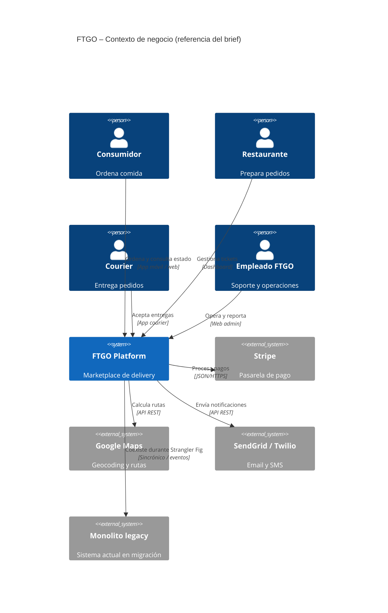
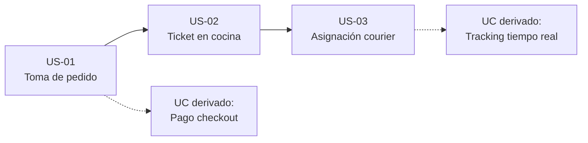

# Anexo A — Brief del caso FTGO

Toma este brief como **única fuente oficial del dominio**: cualquier decisión arquitectónica debe poder rastrearse a este documento, a un capítulo del libro de Richardson o a una de las user stories semilla. **Inventar dominio fuera de aquí penaliza.**

---

## Metadatos del caso

| Campo | Valor |
| :--- | :--- |
| **Producto** | FTGO (Food To Go) |
| **Industria** | Marketplace de delivery de comida |
| **Fuente canónica** | Richardson, *Microservices Patterns*, Manning 2019 |
| **Repositorio oficial** | [ftgo-application](https://github.com/microservices-patterns/ftgo-application) |

---

## A.1 — Contexto de negocio

**FTGO** es una plataforma de delivery que conecta consumidores con restaurantes y ofrece entrega de comida a domicilio. El negocio opera desde hace varios años como una **aplicación monolítica Java** empaquetada en WAR.

El monolito muestra los síntomas clásicos del *infierno monolítico* (Cap. 1 del libro):

- Builds lentos
- Escalado conflictivo entre módulos
- Falta de aislamiento de fallos
- Lock-in tecnológico
- Equipo bloqueado por el tamaño del código

La dirección decidió migrar a **microservicios** para sostener el crecimiento. El equipo de arquitectura debe documentar la arquitectura objetivo con claridad suficiente para iniciar una **migración incremental (Strangler Fig)**.

### Tu rol como maestrante

Actúas como el arquitecto que produce los documentos iniciales de la nueva arquitectura (**PRD + FSD + ADRs + diagramas C4**) usando FTGO como base. No construyes el sistema desde cero: **documentas la arquitectura objetivo para migrar**.

---

## A.2 — Stakeholders

| Rol | Descripción | Interés primario |
| :--- | :--- | :--- |
| **Consumidor** | Usuario final (móvil/web) que ordena comida | UX rápida, transparencia del estado del pedido, tracking en tiempo real |
| **Restaurante** | Negocio asociado que prepara la comida | Gestión de tickets, control de carga de cocina, dashboard de pedidos |
| **Courier** | Repartidor independiente | Asignaciones cercanas, rutas optimizadas, pago confiable |
| **Empleado FTGO** (back office) | Soporte, finanzas, operaciones | Visibilidad, reportes, resolución de incidentes |
| **Equipo de arquitectura** (tú) | Rediseño hacia microservicios | Calidad arquitectónica, trazabilidad, mantenibilidad |
| **Sistemas externos** | Stripe, Google Maps, SendGrid, Twilio | Integración estable, SLAs predecibles |

### Vista de contexto (referencia)

Diagrama orientativo para C4 nivel 1; no sustituye el diseño detallado de los ADRs.

---

## A.3 — Capacidades de negocio (Cap. 2 del libro)

Las **7 capacidades de negocio** estables del libro son candidatas a microservicios, no un mapa 1:1 obligatorio.

| # | Capacidad | Responsabilidad |
| :---: | :--- | :--- |
| 1 | **Consumer Management** | Registro, perfiles, direcciones y preferencias de consumidores |
| 2 | **Restaurant Management** | Restaurantes, menús, horarios y disponibilidad |
| 3 | **Order Taking** | Toma de pedidos: validación, total y confirmación |
| 4 | **Order Fulfillment / Kitchen** | Tickets al restaurante y estado de preparación |
| 5 | **Delivery** | Asignación de couriers, rutas y tracking en tiempo real |
| 6 | **Billing & Accounting** | Cobros, comisiones y payouts a restaurantes y couriers |
| 7 | **Notifications** | Email, SMS y push: confirmaciones, alertas y recibos |

> **Nota:** estas capacidades **no** son automáticamente un microservicio cada una. En ADRs y diagramas C4 debes decidir el grado de descomposición según **trade-offs concretos** del caso FTGO.

---

## A.4 — Restricciones técnicas y NFRs base

Cada NFR del PRD debe rastrearse a una entrada de esta tabla (o a una inferencia **explícita y justificada**).

| Categoría | Restricción / NFR |
| :--- | :--- |
| **Carga** | Tráfico pico **5×** en almuerzo y cena (12:00–14:00 y 19:00–22:00, hora local) |
| **Latencia UX** | Respuesta percibida **< 200 ms p95** en acciones del consumidor en la app |
| **Disponibilidad** | **99,9 %** mensual mínimo en toma de pedidos; tracking puede degradar a **99,5 %** |
| **Tolerancia a fallos externos** | Tomar pedidos aunque la pasarela esté caída (cola de retry); degradación temporal aceptable en mapas |
| **Escalabilidad horizontal** | Cada componente escalable de forma independiente (ejes X e Y del Scale Cube) |
| **Consistencia de datos** | Consistencia eventual entre servicios para reporting; **consistencia fuerte** dentro del aggregate del pedido |
| **Trazabilidad** | Rastreo end-to-end de acciones del consumidor (correlation ID, distributed tracing) |
| **Migración incremental** | Monolito no se reemplaza de golpe; **Strangler Fig** durante **18–24 meses** |
| **Tecnología** | **Java/Spring Boot** preferido en el core; libertad en servicios satélite |
| **Cumplimiento** | **PCI-DSS** delegado a Stripe; **GDPR** y normativa local para datos de consumidores |

---

## A.5 — User stories semilla

Son el **punto de partida obligatorio** del FSD. Debes extenderlas a **≥ 5 casos de uso** con bloques Given/When/Then y derivar **≥ 2 UCs adicionales** justificables desde este brief o el libro (no inventados).

### US-01 — Toma de pedido por el consumidor

**Como** Consumidor, **quiero** realizar un pedido desde el menú de un restaurante seleccionado, **para** recibir mi comida en casa de forma rápida y confiable.

**Aceptación esperada en el FSD:**

- El consumidor puede ver el menú del restaurante elegido.
- Puede agregar o quitar ítems del carrito.
- Puede confirmar el pedido con dirección de entrega y método de pago.
- El sistema valida disponibilidad del restaurante y stock.
- El consumidor recibe confirmación con un **número de pedido único**.

### US-02 — Aceptación de tickets por el restaurante

**Como** Restaurante, **quiero** aceptar o rechazar tickets de pedido entrantes, **para** gestionar la carga de cocina sin saturarla.

**Aceptación esperada en el FSD:**

- El restaurante recibe notificación de nuevos tickets en su dashboard.
- Puede aceptar (con tiempo estimado de preparación) o rechazar con motivo.
- El consumidor recibe actualización del estado del pedido.
- Si rechaza, el pedido se cancela y se notifica al consumidor.

### US-03 — Asignación de entrega al courier

**Como** Courier, **quiero** recibir asignaciones de entrega cercanas y aceptarlas o rechazarlas, **para** optimizar mi ruta y mis ingresos.

**Aceptación esperada en el FSD:**

- El courier marca disponibilidad en la app.
- El sistema ofrece pedidos listos para retirar cerca de su ubicación.
- El courier acepta o rechaza dentro de un timeout (ej. **30 s**).
- Al aceptar, ve la ruta optimizada al restaurante y al consumidor.

### UCs adicionales derivables (ejemplos válidos)

- Pago en checkout
- Tracking en tiempo real para el consumidor
- Dashboard de reportes para back office
- Reasignación automática si un courier rechaza
- Cancelación por el consumidor
- Gestión de menús del restaurante

### Flujo semilla (referencia)

---

## A.6 — Restricciones del laboratorio

- **Fuente única del dominio:** este brief + el PDF de Richardson. No inventar stakeholders, capacidades ni NFRs fuera de aquí.
- **Trazabilidad obligatoria:** cada decisión en PRD, FSD, ADR o C4 debe citar el origen (`[Brief §A.x]`, libro cap. Y, `US-NN`).
- **Granularidad apropiada:** PRD y FSD **ligeros**; cubre lo esencial, no agotes el dominio.
- **Migración incremental:** los ADRs deben asumir que el **monolito sigue vivo** y la migración es gradual (Strangler Fig).

---

## A.7 — Enlaces de referencia

| Recurso | URL |
| :--- | :--- |
| Repositorio oficial FTGO | [github.com/microservices-patterns/ftgo-application](https://github.com/microservices-patterns/ftgo-application) |
| Microservices Pattern Language | [microservices.io](https://microservices.io/) |
