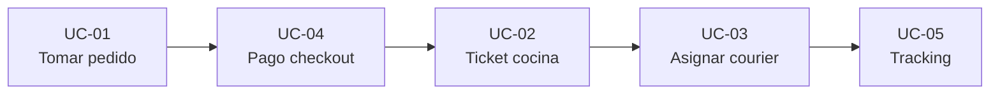

# FSD — FTGO (Food To Go)

| Campo | Valor |
| :--- | :--- |
| **Versión** | 1.1 |
| **Fecha** | 2026-05-22 |
| **Entrada** | [PRD v1.1](PRD.md) · [Brief §A.5](Brief.md) |
| **Referencia previa** | FSD v1.0 (corrida 1, prompt v0.4) |
| **Prompt** | PR-FSD-FTGO-001 v0.5 |
| **Estado** | Borrador para ADRs y validación BDD |

---

## Introducción

Este **FSD ligero** formaliza el flujo de pedido FTGO alineado al [PRD v1.1](PRD.md) (tabla **capacidad → US** en §5) y al brief **§A.5**. Cubre **UC-01…UC-05**: toma de pedido, pago, ticket en cocina, asignación al courier y tracking. Fuera de alcance: back office, gestión de menús y UC-06/07 opcionales.

---

## Diagrama de flujo de casos de uso



---

## Tabla de casos de uso

| ID | Título | Actor primario | Capacidad PRD | Origen |
| :--- | :--- | :--- | :--- | :--- |
| UC-01 | Tomar pedido | Consumidor | Order Taking (§3.3) | [Brief §A.5 US-01] |
| UC-02 | Aceptar o rechazar ticket de pedido | Restaurante | Order Fulfillment / Kitchen (§3.4) | [Brief §A.5 US-02] |
| UC-03 | Asignar pedido a courier | Courier | Delivery (§3.5) | [Brief §A.5 US-03] |
| UC-04 | Procesar pago en checkout | Consumidor | Order Taking + Billing (§3.3, §3.6) | [Brief §A.5 — pago checkout] |
| UC-05 | Consultar tracking en tiempo real | Consumidor | Delivery + Notifications (§3.5, §3.7) | [Brief §A.5 — tracking] |

---

## UC-01: Tomar pedido

| Campo | Valor |
| :--- | :--- |
| **Actor primario** | Consumidor |
| **Capacidad PRD** | Order Taking (§3.3) |
| **Origen** | [Brief §A.5 US-01] |

**Precondiciones:** Consumidor autenticado; restaurante con menú disponible.

**Flujo principal:**

1. Consulta el **menú** del restaurante.
2. **Agrega o quita** ítems del carrito.
3. Confirma con **dirección de entrega** y **método de pago**.
4. El sistema **valida** restaurante y **stock**.
5. Devuelve **número de pedido único**.

**Flujos alternativos:**

- **FA-01:** restaurante no disponible → no se crea pedido.
- **FA-02:** ítem sin stock → carrito actualizado y aviso al Consumidor.

**Postcondiciones:** pedido creado; listo para UC-04 (pago).

**Given/When/Then:**

- **Given:** carrito con ≥ 1 ítem y restaurante disponible.
- **When:** el Consumidor confirma con dirección y pago válidos.
- **Then:** el sistema crea el pedido y muestra número único.

---

## UC-02: Aceptar o rechazar ticket de pedido

| Campo | Valor |
| :--- | :--- |
| **Actor primario** | Restaurante |
| **Capacidad PRD** | Order Fulfillment / Kitchen (§3.4) |
| **Origen** | [Brief §A.5 US-02] |

**Precondiciones:** ticket pendiente tras pago (UC-04).

**Flujo principal:**

1. **Notificación** de nuevo ticket en dashboard.
2. Restaurante **acepta** con **tiempo estimado de preparación**.
3. Sistema **notifica** al Consumidor el nuevo estado.

**Flujos alternativos:**

- **FA-01 — Rechazo:** rechaza con **motivo** → pedido **cancelado** y **notificación** al Consumidor.

**Postcondiciones:** en preparación o cancelado.

**Given/When/Then:**

- **Given:** ticket nuevo en dashboard.
- **When:** acepta con ETA de preparación.
- **Then:** estado «en preparación» y Consumidor notificado.

---

## UC-03: Asignar pedido a courier

| Campo | Valor |
| :--- | :--- |
| **Actor primario** | Courier |
| **Capacidad PRD** | Delivery (§3.5) |
| **Origen** | [Brief §A.5 US-03] |

**Precondiciones:** pedido listo para retirar; couriers en zona.

**Flujo principal:**

1. Courier marca **disponibilidad**.
2. Sistema ofrece pedidos **cercanos** listos para retirar.
3. Courier **acepta** en **30 s**.
4. Sistema muestra **ruta optimizada** restaurante → consumidor.

**Flujos alternativos:**

- **FA-01:** rechazo o timeout 30 s → oferta a otro courier (UC-06 fuera de alcance).

**Postcondiciones:** courier asignado; ruta visible.

**Given/When/Then:**

- **Given:** courier disponible y pedido listo cerca.
- **When:** acepta dentro de **30 s**.
- **Then:** courier registrado y ruta optimizada mostrada.

---

## UC-04: Procesar pago en checkout

| Campo | Valor |
| :--- | :--- |
| **Actor primario** | Consumidor |
| **Capacidad PRD** | Order Taking + Billing (§3.3, §3.6) |
| **Origen** | [Brief §A.5 — pago checkout] |

**Precondiciones:** pedido de UC-01 con total y método de pago.

**Flujo principal:**

1. Consumidor inicia **cobro** en checkout.
2. Cargo a **Stripe**.
3. Pago **confirmado** → pedido pagado → habilita ticket cocina (UC-02).

**Flujos alternativos:**

- **FA-01 — Pasarela caída ([PRD NFR-04]):** pedido en **pendiente de pago**, **cola retry**, Consumidor notificado; pedido no se pierde.

**Postcondiciones:** pagado o pendiente retry; sin PAN en FTGO.

**Given/When/Then:**

- **Given:** pedido confirmado con total y medio de pago hacia Stripe.
- **When:** confirma pago en checkout.
- **Then:** estado «pagado» o «pendiente pago (retry)» registrado.

---

## UC-05: Consultar tracking en tiempo real

| Campo | Valor |
| :--- | :--- |
| **Actor primario** | Consumidor |
| **Capacidad PRD** | Delivery + Notifications (§3.5, §3.7) |
| **Origen** | [Brief §A.5 — tracking; PRD NFR-02] |

**Precondiciones:** pedido activo en curso (UC-02/03).

**Flujo principal:**

1. Consumidor abre detalle del pedido.
2. Ve **estado actual** y ETA/ubicación.
3. Recibe **notificaciones** ante cambios (Notifications §3.7).

**Flujos alternativos:**

- **FA-01 — Degradación ([PRD NFR-03]):** último estado conocido si tracking no responde.

**Postcondiciones:** visibilidad end-to-end ([PRD NFR-07]).

**Given/When/Then:**

- **Given:** pedido activo con ≥ 1 cambio de estado.
- **When:** consulta tracking en la app.
- **Then:** muestra estado y ETA/ubicación actualizados.

---

## Criterios §A.5 cubiertos por UC

| UC | Criterio brief | Cubierto en |
| :--- | :--- | :--- |
| UC-01 | Ver menú restaurante | Flujo paso 1 |
| UC-01 | Agregar/quitar carrito | Flujo paso 2 |
| UC-01 | Confirmar dirección y pago | Flujo paso 3, GWT When |
| UC-01 | Validar restaurante y stock | Flujo paso 4, FA-01/02 |
| UC-01 | Número de pedido único | Flujo paso 5, GWT Then |
| UC-02 | Notificación tickets dashboard | Flujo paso 1 |
| UC-02 | Aceptar con ETA o rechazar motivo | Flujo paso 2, FA-01 |
| UC-02 | Consumidor actualizado | Flujo paso 3, GWT Then |
| UC-02 | Rechazo cancela y notifica | FA-01 |
| UC-03 | Marcar disponibilidad | Flujo paso 1 |
| UC-03 | Ofertas cercanas listas retirar | Flujo paso 2 |
| UC-03 | Aceptar/rechazar en 30 s | Flujo paso 3, GWT When |
| UC-03 | Ruta optimizada al aceptar | Flujo paso 4, GWT Then |
| UC-04 | Pago en checkout (derivado) | Flujo principal |
| UC-04 | Tolerancia pasarela caída | FA-01, NFR-04 |
| UC-05 | Tracking tiempo real (derivado) | Flujo principal |
| UC-05 | Degradación tracking | FA-01, NFR-03 |

**Cobertura F9:** 17/17 ítems = **100 %**.

---

## Trazabilidad PRD v1.1

| UC | US | Capacidad (PRD §5) |
| :--- | :--- | :--- |
| UC-01 | US-01 | Order Taking |
| UC-02 | US-02 | Order Fulfillment / Kitchen |
| UC-03 | US-03 | Delivery |
| UC-04 | Derivado §A.5 | Billing & Accounting |
| UC-05 | Derivado §A.5 | Delivery + Notifications |

---

## Verificación del FSD (F1–F9)

```text
Verificación FSD: F1–F9 → 9/9 ✅ | Pendientes: ninguna
```

| # | Resultado |
| :---: | :--- |
| F1 | ✅ Metadatos, intro, diagrama, tabla, 5 UCs, criterios, verificación |
| F2 | ✅ UC-01…05 catálogo |
| F3 | ✅ 35/35 campos (7 × 5 UCs) |
| F4 | ✅ 5/5 GWT completos |
| F5 | ✅ Tabla 5 filas |
| F6 | ✅ 100 % trazabilidad |
| F7 | ✅ ≤ 2 500 palabras |
| F8 | ✅ 0 UCs inventados |
| F9 | ✅ 17/17 criterios §A.5 |

---

## Métrica de calidad — corrida 2

Generación con **PR-FSD-FTGO-001 v0.5** (referencia: FSD v1.0 / corrida 1 v0.4).

| Campo | Valor |
| :--- | :--- |
| **Corrida** | 2 (después, prompt v0.5) |
| **Fecha** | 2026-05-22 |
| **Modelo** | Composer (Cursor) |
| **Iteraciones** | 1 |
| **Artefacto** | FSD v1.1 |
| **Entrada** | PRD v1.1 |

### Indicadores

| Código | Valor | Meta |
| :--- | :---: | :---: |
| F2 — UCs catálogo / 5 | 5 | 5 |
| F3 — Campos completos (%) | 100 | 100 |
| F4 — GWT completos (%) | 100 | 100 |
| F5 — Tabla resumen | ✅ | ✅ |
| F6 — Trazabilidad (%) | 100 | 100 |
| F7 — Palabras | 1 689 | ≤ 2 500 |
| F8 — UCs inventados | 0 | 0 |
| F9 — Criterios §A.5 (%) | 100 | ≥ 95 |
| F10 — Diagrama flujo | ✅ | ✅ |
| F11 — Verificación F1–F9 | 9/9 | 9 |

### Cobertura funcional (CF)

| Componente | Cálculo | Puntos |
| :--- | :--- | :---: |
| Catálogo UC | (5/5) × 30 % | 30 % |
| Campos | 100 % × 25 % | 25 % |
| GWT | 100 % × 25 % | 25 % |
| Trazabilidad | 100 % × 10 % | 10 % |
| Criterios §A.5 | 100 % × 10 % | 10 % |
| **CF total** | | **100 %** |

### Mejora vs corrida 1 (v1.0)

| Indicador | Corrida 1 (v0.4) | Corrida 2 (v0.5) | Δ |
| :--- | :---: | :---: | :---: |
| CF (fórmula) | 100 %* | **100 %** | 0 |
| F9 — Criterios §A.5 | — | **100 %** | +100 % |
| F10 — Diagrama | ❌ | **✅** | +1 |
| F11 — Verificación | 0/8 | **9/9** | +9 |
| Entrada PRD | v1.0 | **v1.1** | — |
| F7 — Palabras | 1 302 | 1 689 | +387 |

\* CF v0.4 sin F9/F10/F11.
