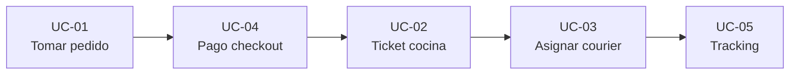

# FSD — FTGO (Food To Go)

| Campo | Valor |
| :--- | :--- |
| **Versión** | 1.2 |
| **Fecha** | 2026-05-22 |
| **Entrada** | [PRD v1.2](PRD.md) · [Brief §A.5](Brief.md) |
| **Referencia previa** | FSD v1.1 (corrida 2, prompt v0.5) |
| **Prompt** | PR-FSD-FTGO-001 v0.6 |
| **Estado** | Borrador para ADRs y validación BDD |

---

## Introducción

Este **FSD ligero** formaliza el flujo de pedido FTGO alineado al [PRD v1.2](PRD.md) (capacidades §3, NFR §4, cadena PRD→FSD→ADR en §5) y al brief **§A.5**. Cubre **UC-01…UC-05**: toma de pedido, pago, ticket en cocina, asignación al courier y tracking. Fuera de alcance: back office, gestión de menús y UC-06/07 opcionales.

---

## Diagrama de flujo de casos de uso



---

## Tabla de casos de uso

| ID | Título | Actor primario | Capacidad PRD | Origen |
| :--- | :--- | :--- | :--- | :--- |
| UC-01 | Tomar pedido | Consumidor | Order Taking (§3.3) | [Brief §A.5 US-01] |
| UC-02 | Aceptar o rechazar ticket de pedido | Restaurante | Order Fulfillment / Kitchen (§3.4) | [Brief §A.5 US-02] |
| UC-03 | Asignar pedido a courier | Courier | Delivery (§3.5) | [Brief §A.5 US-03] |
| UC-04 | Procesar pago en checkout | Consumidor | Order Taking + Billing (§3.3, §3.6) | [Brief §A.5 — pago checkout] |
| UC-05 | Consultar tracking en tiempo real | Consumidor | Delivery + Notifications (§3.5, §3.7) | [Brief §A.5 — tracking] |

---

## Trazabilidad UC → NFR (PRD §4)

| UC | NFR PRD | Aplicación en el flujo |
| :--- | :--- | :--- |
| UC-01 | NFR-01, NFR-02, NFR-03 | Picos de pedido; latencia menú/carrito; disponibilidad toma de pedidos |
| UC-02 | NFR-02, NFR-03 | Notificaciones al consumidor; disponibilidad del flujo cocina |
| UC-03 | NFR-01, NFR-02, NFR-04 | Carga en delivery; UX asignación; degradación mapas |
| UC-04 | NFR-04, NFR-10 | Pasarela caída (retry); PCI vía Stripe |
| UC-05 | NFR-02, NFR-03, NFR-07 | Latencia tracking; disponibilidad 99,5 %; correlation ID |

---

## Dependencias entre casos de uso

| Orden | UC | Precondición / disparador | Habilita |
| :---: | :--- | :--- | :--- |
| 1 | UC-01 | Consumidor autenticado, menú disponible | UC-04 |
| 2 | UC-04 | Pedido creado (UC-01) con total y pago | UC-02 |
| 3 | UC-02 | Pago confirmado (UC-04) | UC-03 |
| 4 | UC-03 | Pedido listo para retirar | UC-05 (tracking continuo) |
| — | UC-05 | Pedido activo tras UC-02/03 | Consulta en paralelo al reparto |

---

## UC-01: Tomar pedido

| Campo | Valor |
| :--- | :--- |
| **Actor primario** | Consumidor |
| **Capacidad PRD** | Order Taking (§3.3) |
| **Origen** | [Brief §A.5 US-01] |

**Precondiciones:** Consumidor autenticado; restaurante con menú disponible.

**Flujo principal:**

1. Consulta el **menú** del restaurante.
2. **Agrega o quita** ítems del carrito.
3. Confirma con **dirección de entrega** y **método de pago**.
4. El sistema **valida** restaurante y **stock**.
5. Devuelve **número de pedido único**.

**Flujos alternativos:** restaurante no disponible (sin pedido); ítem sin stock (carrito actualizado).

**Postcondiciones:** pedido creado → UC-04.

**Given/When/Then:**

- **Given:** carrito con ≥ 1 ítem y restaurante disponible.
- **When:** el Consumidor confirma con dirección y pago válidos.
- **Then:** el sistema crea el pedido y muestra número único.

---

## UC-02: Aceptar o rechazar ticket de pedido

| Campo | Valor |
| :--- | :--- |
| **Actor primario** | Restaurante |
| **Capacidad PRD** | Order Fulfillment / Kitchen (§3.4) |
| **Origen** | [Brief §A.5 US-02] |

**Precondiciones:** ticket pendiente tras pago (UC-04).

**Flujo principal:**

1. **Notificación** de nuevo ticket en dashboard.
2. Restaurante **acepta** con **tiempo estimado de preparación**.
3. Sistema **notifica** al Consumidor el nuevo estado.

**Flujos alternativos:**

- **FA-01 — Rechazo:** motivo → pedido cancelado y notificación al Consumidor.

**Postcondiciones:** en preparación o cancelado → UC-03 si aceptado.

**Given/When/Then:**

- **Given:** ticket nuevo en dashboard.
- **When:** acepta con ETA de preparación.
- **Then:** estado «en preparación» y Consumidor notificado.

---

## UC-03: Asignar pedido a courier

| Campo | Valor |
| :--- | :--- |
| **Actor primario** | Courier |
| **Capacidad PRD** | Delivery (§3.5) |
| **Origen** | [Brief §A.5 US-03] |

**Precondiciones:** pedido listo para retirar; couriers en zona.

**Flujo principal:**

1. Courier marca **disponibilidad**.
2. Sistema ofrece pedidos **cercanos** listos para retirar.
3. Courier **acepta** en **30 s**.
4. Sistema muestra **ruta optimizada** restaurante → consumidor.

**Flujos alternativos:**

- **FA-01:** rechazo o timeout 30 s → reoferta (UC-06 fuera de alcance).

**Postcondiciones:** courier asignado → UC-05.

**Given/When/Then:**

- **Given:** courier disponible y pedido listo cerca.
- **When:** acepta dentro de **30 s**.
- **Then:** courier registrado y ruta optimizada mostrada.

---

## UC-04: Procesar pago en checkout

| Campo | Valor |
| :--- | :--- |
| **Actor primario** | Consumidor |
| **Capacidad PRD** | Order Taking + Billing (§3.3, §3.6) |
| **Origen** | [Brief §A.5 — pago checkout] |

**Precondiciones:** pedido de UC-01 con total y método de pago.

**Flujo principal:** cobro checkout → Stripe → confirmado → habilita UC-02.

**Flujos alternativos:** pasarela caída ([NFR-04]) → pendiente pago + cola retry.

**Postcondiciones:** pagado o pendiente; sin PAN en FTGO.

**Given/When/Then:**

- **Given:** pedido confirmado con total y medio de pago hacia Stripe.
- **When:** confirma pago en checkout.
- **Then:** estado «pagado» o «pendiente pago (retry)» registrado.

---

## UC-05: Consultar tracking en tiempo real

| Campo | Valor |
| :--- | :--- |
| **Actor primario** | Consumidor |
| **Capacidad PRD** | Delivery + Notifications (§3.5, §3.7) |
| **Origen** | [Brief §A.5 — tracking; PRD NFR-02] |

**Precondiciones:** pedido activo en curso (UC-02/03).

**Flujo principal:** detalle pedido → estado y ETA/ubicación → notificaciones (§3.7).

**Flujos alternativos:** degradación ([NFR-03]) → último estado conocido.

**Postcondiciones:** visibilidad E2E ([NFR-07]).

**Given/When/Then:**

- **Given:** pedido activo con ≥ 1 cambio de estado.
- **When:** consulta tracking en la app.
- **Then:** muestra estado y ETA/ubicación actualizados.

---

## Criterios §A.5 (resumen)

| UC | Criterios brief cubiertos |
| :--- | :--- |
| UC-01 | Menú, carrito, confirmar dirección/pago, validar stock, nº pedido único |
| UC-02 | Notificación ticket, aceptar ETA / rechazar motivo, actualizar consumidor |
| UC-03 | Disponibilidad, ofertas cercanas, aceptar 30 s, ruta optimizada |
| UC-04 | Pago checkout, tolerancia pasarela (NFR-04) |
| UC-05 | Tracking tiempo real, degradación (NFR-03) |

**F9:** 17/17 = **100 %**.

---

## Trazabilidad PRD v1.2

| UC | US | Capacidad (PRD §5) |
| :--- | :--- | :--- |
| UC-01 | US-01 | Order Taking |
| UC-02 | US-02 | Order Fulfillment / Kitchen |
| UC-03 | US-03 | Delivery |
| UC-04 | Derivado §A.5 | Billing & Accounting |
| UC-05 | Derivado §A.5 | Delivery + Notifications |

---

## Verificación del FSD (F1–F9)

```text
Verificación FSD: F1–F9 → 9/9 ✅ | Pendientes: ninguna
```

| # | Resultado |
| :---: | :--- |
| F1 | ✅ Metadatos, intro, diagrama, tabla, 5 UCs, criterios, verificación |
| F2 | ✅ UC-01…05 catálogo |
| F3 | ✅ 35/35 campos (7 × 5 UCs) |
| F4 | ✅ 5/5 GWT completos |
| F5 | ✅ Tabla 5 filas |
| F6 | ✅ 100 % trazabilidad |
| F7 | ✅ ≤ 2 500 palabras |
| F8 | ✅ 0 UCs inventados |
| F9 | ✅ 17/17 criterios §A.5 |

---

## Métrica de calidad — corrida 3

Generación con **PR-FSD-FTGO-001 v0.6** (referencia: FSD v1.1 / corrida 2 v0.5).

| Campo | Valor |
| :--- | :--- |
| **Corrida** | 3 (después, prompt v0.6) |
| **Fecha** | 2026-05-22 |
| **Modelo** | Composer (Cursor) |
| **Iteraciones** | 1 |
| **Artefacto** | FSD v1.2 |
| **Entrada** | PRD v1.2 |

### Indicadores

| Código | Valor | Meta |
| :--- | :---: | :---: |
| F2 — UCs catálogo / 5 | 5 | 5 |
| F3 — Campos completos (%) | 100 | 100 |
| F4 — GWT completos (%) | 100 | 100 |
| F5 — Tabla resumen | ✅ | ✅ |
| F6 — Trazabilidad (%) | 100 | 100 |
| F7 — Palabras | 1 683 | ≤ 2 500 |
| F8 — UCs inventados | 0 | 0 |
| F9 — Criterios §A.5 (%) | 100 | ≥ 95 |
| F10 — Diagrama flujo | ✅ | ✅ |
| F11 — Verificación F1–F9 | 9/9 | 9 |
| F12 — Tabla UC→NFR | ✅ | ✅ |
| F13 — Dependencias UC | ✅ | ✅ |
| F14 — F7 rango 1 200–1 550 | ⚠️ | meta |

### Cobertura funcional (CF)

| Componente | Cálculo | Puntos |
| :--- | :--- | :---: |
| Catálogo UC | (5/5) × 30 % | 30 % |
| Campos | 100 % × 25 % | 25 % |
| GWT | 100 % × 25 % | 25 % |
| Trazabilidad | 100 % × 10 % | 10 % |
| Criterios §A.5 | 100 % × 10 % | 10 % |
| **CF total** | | **100 %** |

---

## Historial métricas (corridas 1–3)

| # | Prompt | CF | F7 | F12 | F13 |
| :---: | :--- | :---: | :---: | :---: | :---: |
| 1 | v0.4 | 100 %* | 1 302 | — | — |
| 2 | v0.5 | 100 % | 1 689 | — | — |
| 3 | v0.6 | **100 %** | ver arriba | ✅ | ✅ |
