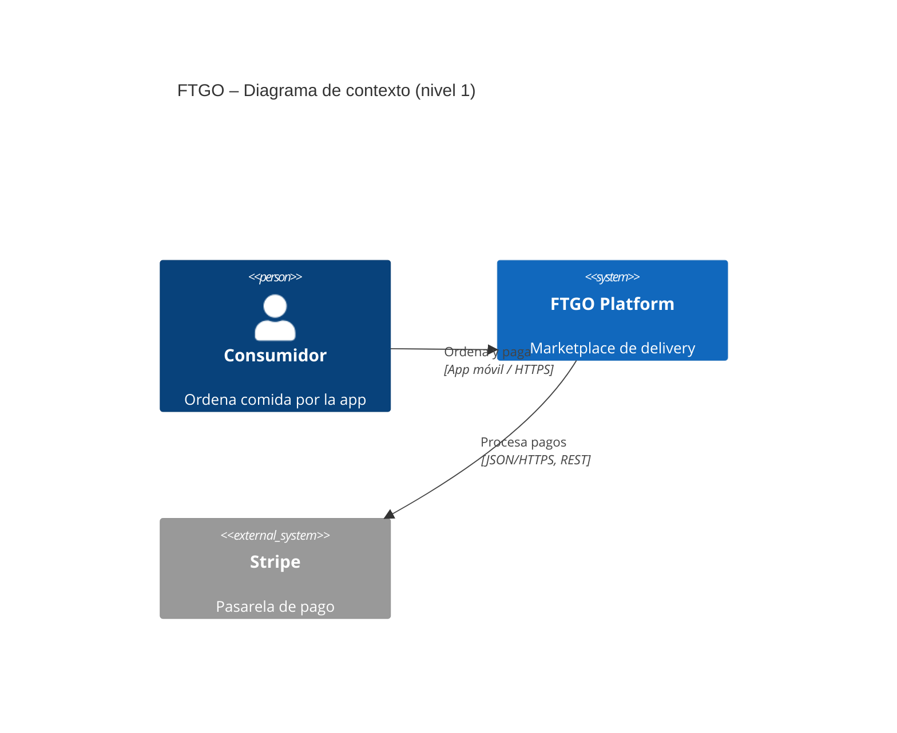
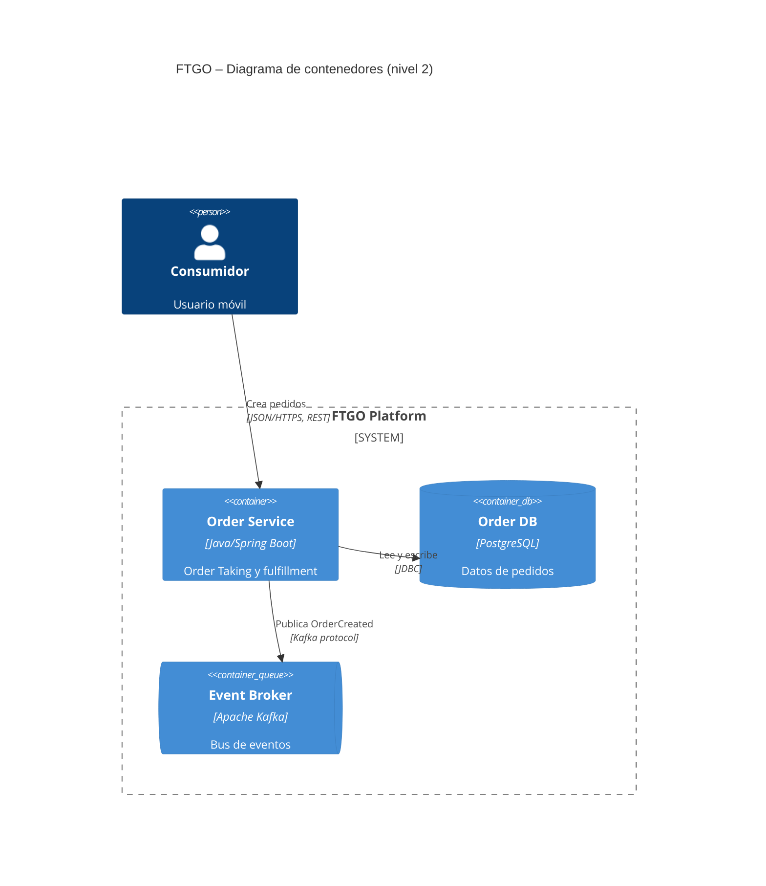

# B.4 — Prompt semilla: diagramas C4 (nivel 1 y 2) de FTGO

Tiene **4 huecos TODO** marcados. Para mejorarlo, aplica los **5 requisitos D4**.

---

## Metadatos

| Campo | Valor |
| :--- | :--- |
| **ID** | PR-C4-FTGO-001 |
| **Artefacto destino** | 2 archivos `.mmd` (C4 nivel 1 y nivel 2) |
| **Modelo recomendado** | Sonnet / Opus |
| **Temperatura** | 0.2 |
| **Versión** | v0.1-seed |

---

## Role

Eres un arquitecto de software experto en el **modelo C4** de Simon Brown y en la sintaxis **Mermaid** para `C4Context` y `C4Container`. Conoces el caso **FTGO** del libro de Richardson y has documentado al menos 10 sistemas con C4.

---

## Task

Produce **2 diagramas Mermaid** del caso FTGO:

| Archivo | Nivel C4 | Contenido |
| :--- | :---: | :--- |
| `c4_context.mmd` | 1 — Contexto | FTGO como un solo sistema + personas + sistemas externos |
| `c4_container.mmd` | 2 — Contenedores | Microservicios, bases de datos, broker, apps y protocolos |

Cada archivo debe contener **un solo bloque** `C4Context` o `C4Container`, sin mezclar niveles.

---

## Context

### Documentos fuente

- `docs/PRD.md` (stakeholders, capacidades y NFRs).
- `docs/adr/0001-*.md` y `docs/adr/0002-*.md` (decisiones que condicionan los contenedores).
- Brief del **Anexo A** (sistemas externos y stakeholders).

### TODO 1 — Sistema y actores del brief

> **TODO 1 (Context — sistema y stakeholders del brief):** enumera explícitamente el sistema principal y todas las personas/sistemas externos que deben aparecer en el diagrama de contexto.
>
> <!-- TODO: completar la lista, ej.
>
> - **Person:** Consumidor, Restaurante, Courier, Empleado FTGO (back office).
> - **System:** FTGO Platform (sistema bajo diseño).
> - **System_Ext:** Stripe (pasarela de pago), Google Maps (geocoding y rutas), SendGrid/Twilio (notificaciones email/SMS), Sistema Legacy Monolito (durante migración Strangler Fig).
>
> Sin esta lista el diagrama omite externos clave del brief. -->

---

## Reasoning

Sigue estos pasos en orden:

1. **Nivel 1 (Context):** representa FTGO como un único `System`, rodeado de `Person` y `System_Ext`. Cada `Rel` debe incluir etiqueta de interacción y, si aplica, tecnología (ej. *«usa la app móvil para ordenar comida»*, `HTTPS`).
2. **Nivel 2 (Container):** dentro de `System_Boundary` de FTGO, dibuja contenedores derivados del PRD y los ADRs (ej. Consumer Service, Order Service, Kitchen Service, Delivery Service, Billing Service, Notification Service, Mobile App, Web Admin, Order DB, Kafka Broker).
3. **TODO 2 (Reasoning — criterio nivel 1 vs nivel 2):** define aquí la regla para decidir qué pertenece al nivel 1 (Context) y qué al nivel 2 (Container).
4. En el nivel 2, cada `Rel` entre contenedores debe declarar **tecnología + protocolo** (ej. `JSON/HTTPS`, `async Kafka`, `JDBC`).
5. Verifica coherencia con los ADRs: si la decisión es async, aparece el broker; si es DB-per-service, hay bases de datos separadas por servicio.

---

## Stop condition

Detente cuando:

- Existen los **2 archivos** Mermaid completos.
- **Nivel 1:** ≥ 1 `Person`, ≥ 2 `System_Ext`, 1 `System` (FTGO).
- **Nivel 2:** ≥ 5 contenedores; todas las relaciones con tecnología y protocolo.
- **TODO 3 (Stop condition — sintaxis válida):** agrega aquí un criterio verificable para garantizar sintaxis Mermaid C4 válida (render en preview, sin errores de parser).

No continues produciendo contenido más allá de estas condiciones.

---

## Output

**Formato:** dos bloques Mermaid, cada uno en su archivo `.mmd` (sin envoltorio Markdown extra en el archivo de salida).

### Esqueleto mínimo — nivel 1 (`c4_context.mmd`)



### Esqueleto mínimo — nivel 2 (`c4_container.mmd`)



### Reglas sintácticas Mermaid C4

| Elemento | Uso en FTGO |
| :--- | :--- |
| `C4Context` / `C4Container` | Primera línea del diagrama; define el tipo de vista |
| `title` | Título visible del diagrama |
| `Person` | Actores humanos (consumidor, restaurante, courier…) |
| `System` | FTGO como caja única en nivel 1 |
| `System_Ext` | Stripe, Maps, notificaciones, monolito legacy |
| `System_Boundary` | Límite de FTGO en nivel 2 |
| `Container` | Microservicios y aplicaciones |
| `ContainerDb` | Bases de datos |
| `ContainerQueue` | Broker (Kafka) si los ADRs lo exigen |
| `Rel(origen, destino, "etiqueta", "tecnología")` | Cuatro argumentos cuando hay protocolo explícito |

### TODO 4 — Referencia sintáctica extendida

> **TODO 4 (Output — sintaxis Mermaid C4 detallada):** especifica aquí los elementos sintácticos exactos y un fragmento de referencia más extenso.
>
> <!-- TODO: ampliar referencia. Ejemplo orientativo:
>
> ```mermaid
> C4Container
>     title FTGO – Container Diagram
>
>     Person(consumer, "Consumidor", "Usuario móvil")
>     Person(restaurant, "Restaurante", "Operador de cocina")
>     System_Ext(stripe, "Stripe", "Pasarela de pago")
>
>     System_Boundary(ftgo, "FTGO Platform") {
>         Container(mobile_app, "Mobile App", "React Native", "App del consumidor")
>         Container(order_svc, "Order Service", "Java 17/Spring Boot", "Toma de pedidos")
>         ContainerDb(order_db, "Order DB", "PostgreSQL 15", "Pedidos e ítems")
>         ContainerQueue(kafka, "Event Broker", "Apache Kafka", "Bus de eventos")
>     }
>
>     Rel(consumer, mobile_app, "Usa", "iOS/Android")
>     Rel(mobile_app, order_svc, "Crea pedidos", "JSON/HTTPS, REST")
>     Rel(order_svc, order_db, "Lee/Escribe", "JDBC")
>     Rel(order_svc, kafka, "Publica OrderCreated", "Kafka protocol")
>     Rel(order_svc, stripe, "Cobra", "JSON/HTTPS")
> ```
>
> Sin un fragmento de referencia, el output suele usar sintaxis inválida que no renderiza en Mermaid. -->

---

## Invariants

- Ambos archivos deben usar sintaxis Mermaid C4 válida (`C4Context` o `C4Container`).
- El nivel 1 debe tener ≥ 1 `Person` y ≥ 2 `System_Ext`.
- El nivel 2 debe tener ≥ 5 contenedores.
- Cada relación del nivel 2 debe declarar **tecnología y protocolo** en el cuarto argumento de `Rel`.

---

## Failure modes

| Código | Descripción |
| :--- | :--- |
| `E_MISSING_INPUTS` | Faltan PRD o ADRs → abortar. |
| `E_INVALID_MERMAID` | La sintaxis no renderiza → reintentar. |
| `E_LEVEL_MIXED` | El nivel 1 expone detalle interno de FTGO → reintentar. |
| `E_NO_TECH_PROTOCOL` | Hay relaciones sin tecnología/protocolo → reintentar. |

---

## Huecos TODO del prompt C4

| # | Ubicación | Qué falta |
| :---: | :--- | :--- |
| 1 | Context | Lista concreta de personas y sistemas externos del brief |
| 2 | Reasoning | Regla para decidir nivel 1 vs nivel 2 |
| 3 | Stop condition | Criterio de sintaxis Mermaid válida |
| 4 | Output | Fragmento sintáctico de referencia más completo |

### Criterio de mejora

Para considerarlo **mejorado**:

- Rellena **≥ 2 huecos**
- Agrega **1 sección nueva**
- Incluye **Changelog**
- Agrega **comando en README**
- Documenta **métrica con 3 corridas**

Guarda el resultado en `prompts_mejorados/c4_mejorado.md`.
