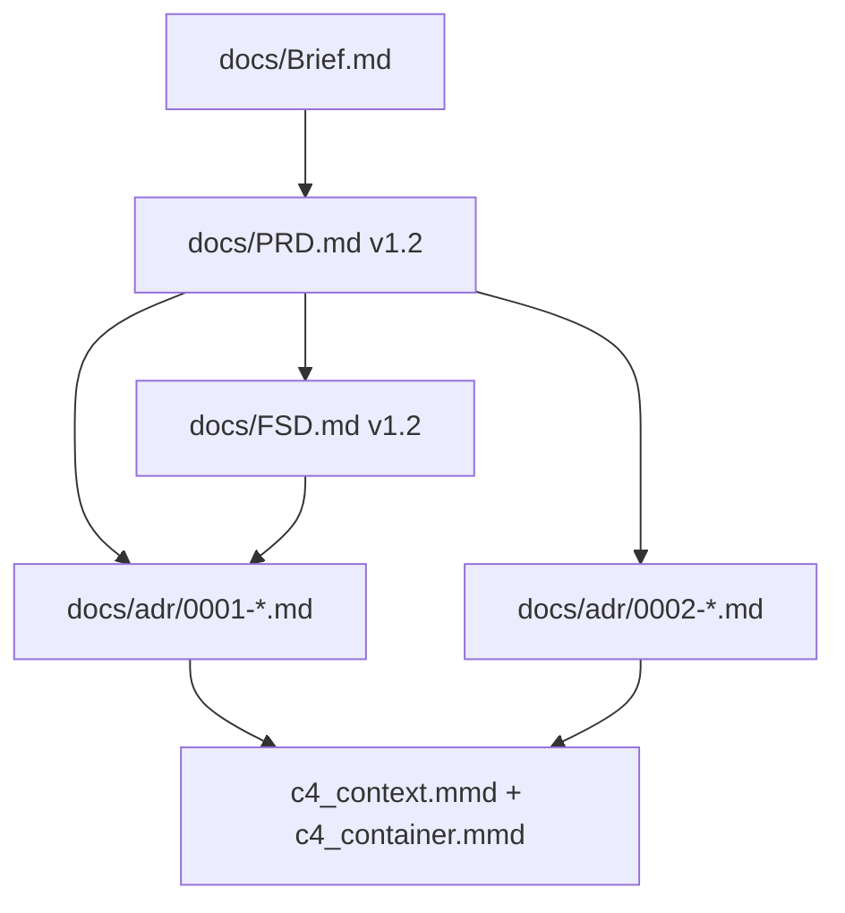

# Sesión de trabajo — Examen FTGO

| Campo | Valor |
| :--- | :--- |
| **Fecha** | 2026-05-22 |
| **Proyecto** | [Examen-FTGO](../README.md) |
| **Fuente canónica** | [Brief.md](Brief.md) (Anexo A) |
| **Herramienta** | Cursor · Composer |

---

## Objetivo de la sesión

Documentar y mejorar el laboratorio FTGO: reformatear prompts semilla, completar **prompts mejorados** desde el brief, generar artefactos **PRD** y **FSD** (corridas 1–3), métricas antes/después y README de uso.

---

## Resumen ejecutivo

| Área | Entregable | Estado |
| :--- | :--- | :---: |
| Brief | `docs/Brief.md` reformateado + diagramas Mermaid | ✅ |
| Prompts semilla | `docs/PROMPTS/*.md` (PRD, FSD, ADR, C4) | ✅ |
| Prompts mejorados | `prompts_mejorados/*.md` v0.4–v0.6 (PRD/FSD) | ✅ |
| Artefacto PRD | `docs/PRD.md` v1.0 → **v1.2** (corrida 3) | ✅ |
| Artefacto FSD | `docs/FSD.md` v1.0 → **v1.2** (corrida 3) | ✅ |
| ADR / C4 | Pendiente | ⏳ |
| README | `README.md` con flujo y métricas | ✅ |

---

## 1. Reformato de documentación (`docs/`)

Se aplicó estructura Markdown uniforme (títulos, tablas, listas, `---`, Mermaid) a:

| Archivo | Mejoras |
| :--- | :--- |
| [Brief.md](Brief.md) | §A.1–A.7, diagrama C4Context y flowchart US |
| [PROMPTS/PRD.md](PROMPTS/PRD.md) | Semilla B.1 |
| [PROMPTS/FSD.md](PROMPTS/FSD.md) | Semilla B.2 |
| [PROMPTS/ADR.md](PROMPTS/ADR.md) | Semilla B.3 |
| [PROMPTS/C4.md](PROMPTS/C4.md) | Semilla B.4 + esqueletos Mermaid C4 |

---

## 2. Prompts mejorados (`prompts_mejorados/`)

Cada prompt pasó de **v0.1-seed** (4 TODO vacíos) a **v0.4–v0.5** con:

- TODO 1–4 rellenados desde [Brief.md](Brief.md)
- Sección D4: **Verification** (PRD, C4), **Examples** (FSD), **Anti-patterns** (ADR)
- **Changelog** con qué y por qué por versión
- **Métrica de calidad (antes / después)** — 6 corridas (3 semilla + 3 mejorado)
- **Tuning corrida 2** (PRD y FSD v0.5) tras métricas de corrida 1

| Prompt | ID | Versión actual | Sección D4 |
| :--- | :--- | :--- | :--- |
| [PRD.md](../prompts_mejorados/PRD.md) | PR-PRD-FTGO-001 | **v0.6** | Verification (V1–V10) |
| [FSD.md](../prompts_mejorados/FSD.md) | PR-FSD-FTGO-001 | **v0.6** | Examples + F1–F9 + F12/F13 |
| [ADR.md](../prompts_mejorados/ADR.md) | PR-ADR-FTGO-001 | v0.4 | Anti-patterns |
| [C4.md](../prompts_mejorados/C4.md) | PR-C4-FTGO-001 | v0.4 | Verification C/K |

---

## 3. Artefactos generados

### PRD — [docs/PRD.md](PRD.md)

| Versión | Prompt | ICP / notas | Evidencia métrica en artefacto |
| :--- | :--- | :--- | :---: |
| **v1.0** | v0.4 | ICP 100 % (fórmula v0.4) | No |
| **v1.1** | v0.5 | ICP 100 % (V1–V9, S8 tabla US) | Sí — § Métrica corrida 2 |
| **v1.2** | v0.6 | ICP 100 % (V1–V10, S10/S11) | Sí — § Métrica corrida 3 + historial |

**Contenido clave v1.2:** v1.1 + **US-01…03 en §1**, tabla **PRD→FSD→ADR**, verificación **V10**, historial corridas 1–3 (S7: 1 462 palabras).

### FSD — [docs/FSD.md](FSD.md)

| Versión | Prompt | CF / notas | Entrada PRD |
| :--- | :--- | :--- | :--- |
| **v1.0** | v0.4 | CF 100 % | v1.0 |
| **v1.1** | v0.5 | CF 100 % (F9, F10, F11) | **v1.1** |
| **v1.2** | v0.6 | CF 100 % (F12, F13) | **v1.2** |

**Contenido clave v1.2:** v1.1 + tabla **UC→NFR**, **dependencias entre UCs**, criterios §A.5 resumidos, historial 1–3 (F7: 1 683; −6 palabras vs c2 en cuerpo UC).

---

## 4. Métricas registradas (corridas «después»)

### PRD (`prompts_mejorados/PRD.md`)

| Corrida | Prompt | ICP | Iter. | S7 palabras | S8 tabla US | S6 |
| :---: | :--- | :---: | :---: | :---: | :---: | :---: |
| 1 | v0.4 | 100 % | 1 | 1 165 | — | 8/8 |
| 2 | v0.5 | 100 % | 1 | 1 315 | ✅ | 9/9 |
| 3 | v0.6 | 100 % | 1 | 1 462 | ✅ | 10/10 |

### FSD (`prompts_mejorados/FSD.md`)

| Corrida | Prompt | CF | Iter. | F7 | F9 | F10 | F11 | F12 | F13 |
| :---: | :--- | :---: | :---: | :---: | :---: | :---: | :---: | :---: | :---: |
| 1 | v0.4 | 100 %* | 1 | 1 302 | — | ❌ | 0/8 | — | — |
| 2 | v0.5 | 100 % | 1 | 1 689 | 100 % | ✅ | 9/9 | — | — |
| 3 | v0.6 | 100 % | 1 | 1 683 | 100 % | ✅ | 9/9 | ✅ | ✅ |

\* Fórmula CF v0.4 sin F9/F10/F11.

---

## 5. Flujo del laboratorio (recomendado)



**Comandos tipo (ver [README.md](../README.md)):**

1. PRD: `docs/Brief.md` + `prompts_mejorados/PRD.md` v0.6 → `docs/PRD.md`
2. FSD: `docs/Brief.md` + `docs/PRD.md` v1.2 + `prompts_mejorados/FSD.md` v0.6 → `docs/FSD.md`
3. ADR ×2: Brief + PRD + FSD + `prompts_mejorados/ADR.md`
4. C4: Brief + PRD + ADRs + `prompts_mejorados/C4.md`

---

## 6. Pendientes sugeridos

| # | Tarea | Depende de |
| :---: | :--- | :--- |
| 1 | Mejorar prompt ADR v0.5 + generar `docs/adr/0001-*.md` (descomposición) | PRD + FSD v1.2 |
| 2 | ADR 0002 (IPC) + C4 con ADRs | ADR 0001 |
| 3 | Corridas «antes» con prompt semilla (3× PRD/FSD) | Comparativa Δ |
| 4 | Afinar S12/F14 (concisión) en corrida 4 si aplica | v0.6 |

---

## 7. Archivos tocados en la sesión

```
docs/
├── Brief.md          (reformato)
├── PRD.md            (v1.0 → v1.2)
├── FSD.md            (v1.0 → v1.2)
├── SESION.md         (este archivo)
└── PROMPTS/
    ├── PRD.md, FSD.md, ADR.md, C4.md

prompts_mejorados/
├── PRD.md            (v0.2 → v0.6)
├── FSD.md            (v0.2 → v0.6)
├── ADR.md            (v0.2 → v0.4)
└── C4.md             (v0.2 → v0.4)

README.md             (guía de uso + métricas)
```

---

## 8. Notas para retomar

- **No inventar dominio** fuera de [Brief.md](Brief.md) + Richardson (§A.6).
- Trazabilidad obligatoria: `[Brief §A.x]`, `US-NN`, capítulos del libro.
- PRD/FSD **ligeros**: ≤ 1 800 / ≤ 2 500 palabras.
- Corrida 3 completada: métricas en `prompts_mejorados/PRD.md` y `FSD.md` + secciones en artefactos v1.2.

---

*Documento generado al cierre de la sesión Cursor del 2026-05-22.*
