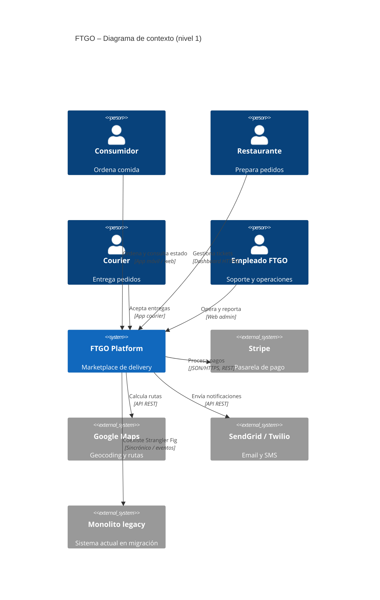

# B.4 — Prompt mejorado: diagramas C4 (nivel 1 y 2) de FTGO

**Versión:** v0.4-improved · **Huecos TODO:** 4/4 · **Sección D4:** Verification · **Métrica:** IVC (antes/después).

---

## Metadatos

| Campo | Valor |
| :--- | :--- |
| **ID** | PR-C4-FTGO-001 |
| **Artefacto destino** | 2 archivos `.mmd` (`c4_context.mmd`, `c4_container.mmd`) |
| **Modelo recomendado** | Sonnet / Opus |
| **Temperatura** | 0.2 |
| **Versión** | v0.4-improved |
| **Brief canónico** | `docs/Brief.md` (§A.2) |
| **Entrada previa** | PRD + ADRs (`docs/adr/0001-*.md`, `0002-*.md`) |

---

## Role

Eres un arquitecto experto en el **modelo C4** de Simon Brown y en sintaxis **Mermaid** (`C4Context`, `C4Container`). Conoces **FTGO** (Richardson) y has documentado sistemas con C4.

---

## Task

Produce **2 diagramas Mermaid**:

| Archivo | Nivel | Contenido obligatorio |
| :--- | :---: | :--- |
| `c4_context.mmd` | 1 | FTGO como un `System` + actores §A.2 + externos |
| `c4_container.mmd` | 2 | Contenedores dentro de `System_Boundary` + protocolos |

Un solo bloque por archivo; **no mezclar** niveles.

---

## Context

### Documentos fuente

- `docs/PRD.md` (capacidades §A.3).
- ADRs en `docs/adr/` (descomposición, IPC, datos).
- `docs/Brief.md` §A.2 (stakeholders y externos).

### Elementos obligatorios del diagrama de contexto (TODO 1 — completado)

| Tipo Mermaid | ID sugerido | Nombre | Origen |
| :--- | :--- | :--- | :--- |
| `Person` | `consumer` | Consumidor | [Brief §A.2] |
| `Person` | `restaurant` | Restaurante | [Brief §A.2] |
| `Person` | `courier` | Courier | [Brief §A.2] |
| `Person` | `backoffice` | Empleado FTGO (back office) | [Brief §A.2] |
| `System` | `ftgo` | FTGO Platform | Sistema bajo diseño |
| `System_Ext` | `stripe` | Stripe — pasarela de pago | [Brief §A.2] |
| `System_Ext` | `maps` | Google Maps — geocoding y rutas | [Brief §A.2] |
| `System_Ext` | `notify` | SendGrid / Twilio — email y SMS | [Brief §A.2] |
| `System_Ext` | `legacy` | Monolito legacy (migración Strangler Fig) | [Brief §A.1, §A.4] |

**Relaciones mínimas nivel 1:** cada `Person` → `ftgo`; `ftgo` → cada `System_Ext` con etiqueta y tecnología (ver referencia en Output).

### Contenedores sugeridos nivel 2 (derivar de PRD + ADRs)

Alineados a las 7 capacidades §A.3 (agrupación según ADRs): Order Service, Kitchen Service, Delivery Service, Consumer Service, Restaurant Service, Billing Service, Notification Service; más Mobile App, Restaurant Dashboard, Courier App, Web Admin; `ContainerDb` por servicio si ADR = DB-per-service; `ContainerQueue` (Kafka) si ADR = IPC async [Brief §A.4 tolerancia a fallos].

---

## Reasoning

1. **Nivel 1:** solo actores humanos, FTGO como caja única y sistemas **fuera** del límite de FTGO.
2. **Nivel 2:** detalle **dentro** de `System_Boundary(ftgo, …)`.
3. Aplica la regla nivel 1 vs 2 (TODO 2).
4. Cada `Rel` en nivel 2: **4 argumentos** (origen, destino, etiqueta, tecnología/protocolo).
5. Coherencia ADR: broker si async; múltiples BD si DB-per-service; `legacy` si Strangler Fig.

### Regla nivel 1 vs nivel 2 (TODO 2 — completado)

| Pregunta | Nivel 1 — `C4Context` | Nivel 2 — `C4Container` |
| :--- | :--- | :--- |
| ¿Es un actor humano? | `Person` | `Person` (solo si interactúa con un contenedor concreto) |
| ¿Es FTGO completo? | Un `System` | `System_Boundary` con varios `Container` |
| ¿Es Stripe, Maps, Twilio, monolito? | `System_Ext` | `System_Ext` (mismos externos) |
| ¿Es un microservicio o BD? | **No aparece** (error `E_LEVEL_MIXED`) | `Container`, `ContainerDb`, `ContainerQueue` |
| ¿Es la app móvil del consumidor? | No (es parte de FTGO en abstracto) | `Container` (Mobile App) |

**Regla práctica:** si el nombre lleva *Service*, *DB*, *Broker* o *App* desplegable → **solo nivel 2**. Si es rol de negocio o SaaS externo → nivel 1 (y nivel 2 si hay `Rel` directa).

---

## Stop condition

Detente cuando:

- Existen **`c4_context.mmd`** y **`c4_container.mmd`** completos.
- **Nivel 1:** ≥ 4 `Person`, ≥ 4 `System_Ext`, 1 `System`, ≥ 8 `Rel`.
- **Nivel 2:** ≥ 5 `Container` (o `ContainerDb`/`ContainerQueue` cuentan); **100 %** de `Rel` internos con 4.º argumento tecnología.
- **Sintaxis válida (TODO 3 — completado):**
  - Primera línea del archivo = `C4Context` o `C4Container` (sin backticks ni fence en el `.mmd`).
  - El diagrama **renderiza** en Mermaid Live Editor o preview de VS Code/Cursor sin error de parser.
  - IDs en `camelCase` o `snake_case` **sin espacios**; comillas solo en etiquetas visibles.
  - No usar `%%` suelto que deje `Rel` incompletos; no anidar fences Markdown dentro del `.mmd`.

No continues produciendo contenido más allá de estas condiciones.

---

## Output

**Formato:** contenido crudo Mermaid en cada `.mmd` (sin envoltorio ` ```mermaid ` en el archivo entregable).

### Referencia nivel 1 — alineada al brief (TODO 4 — parte contexto)

Copia y adapta; debe incluir **todos** los elementos del TODO 1:



### Referencia nivel 2 — extendida (TODO 4 — completado)

Ajusta nombres según ADRs; mantén **Java/Spring Boot** en core [Brief §A.4]:

```mermaid
C4Container
    title FTGO – Diagrama de contenedores (nivel 2)

    Person(consumer, "Consumidor", "Usuario móvil")
    Person(restaurant, "Restaurante", "Operador de cocina")
    Person(courier, "Courier", "Repartidor")
    System_Ext(stripe, "Stripe", "Pasarela de pago")
    System_Ext(maps, "Google Maps", "Rutas")
    System_Ext(legacy, "Monolito legacy", "En migración")

    System_Boundary(ftgo, "FTGO Platform") {
        Container(mobile_app, "Mobile App", "React Native", "App consumidor")
        Container(order_svc, "Order Service", "Java 17 / Spring Boot", "Order Taking")
        Container(kitchen_svc, "Kitchen Service", "Java / Spring Boot", "Order Fulfillment")
        Container(delivery_svc, "Delivery Service", "Java / Spring Boot", "Delivery y tracking")
        Container(billing_svc, "Billing Service", "Java / Spring Boot", "Cobros y payouts")
        Container(notification_svc, "Notification Service", "Java / Spring Boot", "Email SMS push")
        ContainerDb(order_db, "Order DB", "PostgreSQL", "Aggregate pedido")
        ContainerQueue(kafka, "Event Broker", "Apache Kafka", "OrderCreated, status")
    }

    Rel(consumer, mobile_app, "Usa", "iOS / Android")
    Rel(mobile_app, order_svc, "Crea pedidos", "JSON/HTTPS, REST")
    Rel(restaurant, kitchen_svc, "Gestiona tickets", "JSON/HTTPS, REST")
    Rel(courier, delivery_svc, "Acepta entregas", "JSON/HTTPS, REST")
    Rel(order_svc, order_db, "Lee y escribe", "JDBC")
    Rel(order_svc, kafka, "Publica eventos", "Kafka protocol")
    Rel(kitchen_svc, kafka, "Consume/publica", "Kafka protocol")
    Rel(delivery_svc, maps, "Optimiza rutas", "API REST")
    Rel(billing_svc, stripe, "Cobra", "JSON/HTTPS")
    Rel(notification_svc, notify, "Envía mensajes", "API REST")
    Rel(order_svc, legacy, "Facade Strangler", "JSON/HTTPS")
```

### Reglas sintácticas Mermaid C4

| Elemento | Uso en FTGO |
| :--- | :--- |
| `C4Context` / `C4Container` | Primera línea del archivo `.mmd` |
| `title` | Línea inmediatamente después del tipo de diagrama |
| `Person` | Actores §A.2 |
| `System` | Solo en nivel 1 |
| `System_Ext` | Stripe, Maps, notificaciones, legacy |
| `System_Boundary` | Límite FTGO en nivel 2 |
| `Container` / `ContainerDb` / `ContainerQueue` | Solo nivel 2 |
| `Rel(a, b, "etiqueta", "tecnología")` | Obligatorio 4 argumentos en relaciones técnicas nivel 2 |

---

## Invariants

- Sintaxis Mermaid C4 válida y renderizable.
- Nivel 1: ≥ 1 `Person`, ≥ 2 `System_Ext` (este prompt exige **4** externos del brief).
- Nivel 2: ≥ 5 contenedores; relaciones con tecnología/protocolo.

---

## Failure modes

| Código | Descripción |
| :--- | :--- |
| `E_MISSING_INPUTS` | Faltan PRD o ADRs → abortar. |
| `E_INVALID_MERMAID` | No renderiza → reintentar. |
| `E_LEVEL_MIXED` | Microservicios en nivel 1 → reintentar. |
| `E_NO_TECH_PROTOCOL` | `Rel` sin 4.º argumento en nivel 2 → reintentar. |
| `E_MISSING_BRIEF_ACTOR` | Falta Person o System_Ext del TODO 1 → reintentar. |

---

## Verification

Valida **cada archivo** antes de entregarlo. Usa Mermaid Live Editor o preview del IDE.

### `c4_context.mmd`

| # | Verificación | ✅ si… |
| :---: | :--- | :--- |
| C1 | Tipo de diagrama | Primera línea = `C4Context` |
| C2 | Actores | Incluye `consumer`, `restaurant`, `courier`, `backoffice` (§A.2) |
| C3 | Sistema | Un solo `System(ftgo, …)` |
| C4 | Externos | `stripe`, `maps`, `notify`, `legacy` como `System_Ext` |
| C5 | Sin detalle interno | No hay `Container`, `ContainerDb` ni `System_Boundary` |
| C6 | Relaciones | Cada `Person` relacionado con `ftgo`; `ftgo` con cada externo |
| C7 | Render | El diagrama compila sin error de parser |

### `c4_container.mmd`

| # | Verificación | ✅ si… |
| :---: | :--- | :--- |
| K1 | Tipo de diagrama | Primera línea = `C4Container` |
| K2 | Límite | Existe `System_Boundary(ftgo, …)` |
| K3 | Contenedores | ≥ 5 entre `Container`, `ContainerDb`, `ContainerQueue` |
| K4 | Coherencia ADR | Kafka presente si ADR define IPC async; BDs separadas si DB-per-service |
| K5 | Protocolos | 100 % de `Rel` relevantes con **4.º argumento** (tecnología/protocolo) |
| K6 | Externos | Stripe/Maps/legacy fuera del boundary; `Rel` desde contenedores internos |
| K7 | Formato archivo | Sin fences ` ``` ` ni texto Markdown; solo sintaxis Mermaid |
| K8 | Render | Compila en preview; IDs sin espacios |

**Registro rápido (opcional al entregar):**

```text
c4_context.mmd: C1–C7 → [N/7] ✅
c4_container.mmd: K1–K8 → [N/8] ✅
```

---

## Huecos TODO — estado

| # | Ubicación | Estado |
| :---: | :--- | :--- |
| 1 | Context | ✅ Personas y System_Ext §A.2 |
| 2 | Reasoning | ✅ Regla nivel 1 vs 2 |
| 3 | Stop condition | ✅ Render + formato `.mmd` |
| 4 | Output | ✅ Referencias context + container completas |

---

## Changelog

Historial de evolución del prompt **PR-C4-FTGO-001**. Cada entrada documenta *qué* cambió y *por qué*.

### v0.1-seed

| Qué | Por qué |
| :--- | :--- |
| Prompt semilla en `docs/PROMPTS/C4.md` | Produce `c4_context.mmd` (nivel 1) y `c4_container.mmd` (nivel 2) en sintaxis Mermaid C4. |
| **4 TODO** vacíos (actores/externos, regla nivel 1 vs 2, sintaxis válida, referencia extendida) | Sin lista §A.2 faltan Stripe, legacy o couriers; sin regla de niveles aparece `E_LEVEL_MIXED`. |
| Esqueletos Mermaid mínimos en Output | Punto de partida; insuficientes para render consistente sin TODO 4 completo. |

### v0.2-improved (2026-05-22)

| Qué | Por qué |
| :--- | :--- |
| **TODO 1:** tabla de 4 `Person`, 1 `System`, 4 `System_Ext` (Stripe, Maps, notify, legacy) desde §A.2 | Alinea el contexto con el diagrama de referencia del brief; cumple invariante ≥ 2 externos con margen. |
| Lista de **contenedores sugeridos** (7 capacidades + apps + Kafka/BD según ADR) | Nivel 2 debe reflejar PRD y ADRs, no un dibujo genérico. |
| **TODO 2:** regla nivel 1 vs 2 (tabla: actor, FTGO caja única, microservicio solo en nivel 2) | Previene microservicios en `C4Context` (`E_LEVEL_MIXED`). |
| **TODO 3:** criterios de sintaxis (primera línea, render, IDs, sin fences en `.mmd`) | Reduce `E_INVALID_MERMAID` — fallo frecuente en entregas de maestrantes. |
| **TODO 4:** diagramas de referencia completos (context + container) | Fragmento copiable alineado al brief; incluye `legacy` y protocolos en `Rel`. |
| Tabla de **reglas sintácticas** Mermaid C4 | Referencia rápida sin volver al comentario HTML del seed. |
| Failure mode `E_MISSING_BRIEF_ACTOR` | Reintento si omite un elemento obligatorio del TODO 1. |

### v0.3-improved (2026-05-22)

| Qué | Por qué |
| :--- | :--- |
| Sección **Verification** (C1–C7 para context, K1–K8 para container) | Requisito D4: el artefacto son archivos `.mmd` **renderizables**; la verificación manual/automática debe ser explícita antes de entregar. |
| Registro opcional `c4_context.mmd: C1–C7 → N/7 ✅` | Trazabilidad de la auto-revisión en la bitácora del laboratorio sin contaminar el diagrama. |

### v0.4 — Métrica antes/después (2026-05-22)

| Qué | Por qué |
| :--- | :--- |
| **Métrica de calidad** con IVC (C1–C7 + K1–K8) | Evidencia de render válido y menos iteraciones por `E_INVALID_MERMAID`. |

---

## Métrica de calidad (antes / después)

**3 corridas** con `docs/PROMPTS/C4.md` y **3** con este prompt. Mismos PRD + ADRs + Brief; temperatura **0.2**.

### Indicador principal — C4

| Métrica | Definición | Meta (mejorado) |
| :--- | :--- | :---: |
| **Índice de validez C4 (IVC)** | `(checklist context C1–C7 pasados / 7) × 50% + (checklist container K1–K8 pasados / 8) × 50%` | **100 %** en ambos archivos |
| **Iteraciones hasta render OK** | Reintentos hasta `c4_context.mmd` y `c4_container.mmd` compilan sin `E_INVALID_MERMAID` | **≤ 2** (media) |

### Indicadores secundarios

| Código | Qué mide | Cómo contar |
| :--- | :--- | :--- |
| M1 | `c4_context.mmd` render OK | ✅ / ❌ |
| M2 | `c4_container.mmd` render OK | ✅ / ❌ |
| M3 | Checklist C1–C7 (context) | 0–7 |
| M4 | Checklist K1–K8 (container) | 0–8 |
| M5 | % `Rel` nivel 2 con 4.º argumento | 0–100 % |
| M6 | `E_LEVEL_MIXED` (servicios en nivel 1) | ✅ sin error |
| M7 | Person + System_Ext del brief (TODO 1) | 4 Person + 4 Ext ✅ / ❌ |
| M8 | Contenedores ≥ 5 | ✅ / ❌ |
| M9 | Coherencia ADR (Kafka, BD, legacy) | ✅ / ❌ |

### Registro — Antes (prompt semilla v0.1)

| Corrida | Fecha | Modelo | M1 | M2 | M3 | M4 | M5 (%) | M6 | M7 | M8 | M9 | **IVC (%)** | Iteraciones | Evidencia |
| :---: | :--- | :--- | :---: | :---: | :---: | :---: | :---: | :---: | :---: | :---: | :---: | :---: | :---: | :--- |
| 1 | | | | | | | | | | | | | | |
| 2 | | | | | | | | | | | | | | |
| 3 | | | | | | | | | | | | | | |

### Registro — Después (prompt mejorado v0.3)

| Corrida | Fecha | Modelo | M1 | M2 | M3 | M4 | M5 (%) | M6 | M7 | M8 | M9 | **IVC (%)** | Iteraciones | Evidencia |
| :---: | :--- | :--- | :---: | :---: | :---: | :---: | :---: | :---: | :---: | :---: | :---: | :---: | :---: | :--- |
| 1 | | | | | | | | | | | | | | |
| 2 | | | | | | | | | | | | | | |
| 3 | | | | | | | | | | | | | | |

### Resumen comparativo

| Indicador | Antes (media) | Después (media) | Δ |
| :--- | :---: | :---: | :---: |
| IVC (%) | | | |
| Iteraciones hasta render OK | | | |
| M3 — C1–C7 / 7 | | | |
| M4 — K1–K8 / 8 | | | |
| M5 — Rel con protocolo (%) | | | |
| M6 — Sin level mixed | | | |

**Interpretación esperada:** **IVC** → 100 %; **M5** y **M7** mejoran con TODO 1 y referencia Mermaid; **iteraciones** bajan con Verification C/K.

---

**Comando sugerido:** adjuntar `docs/Brief.md`, PRD, ADRs y este prompt; temperatura **0.2**; entregar solo los dos `.mmd`.
